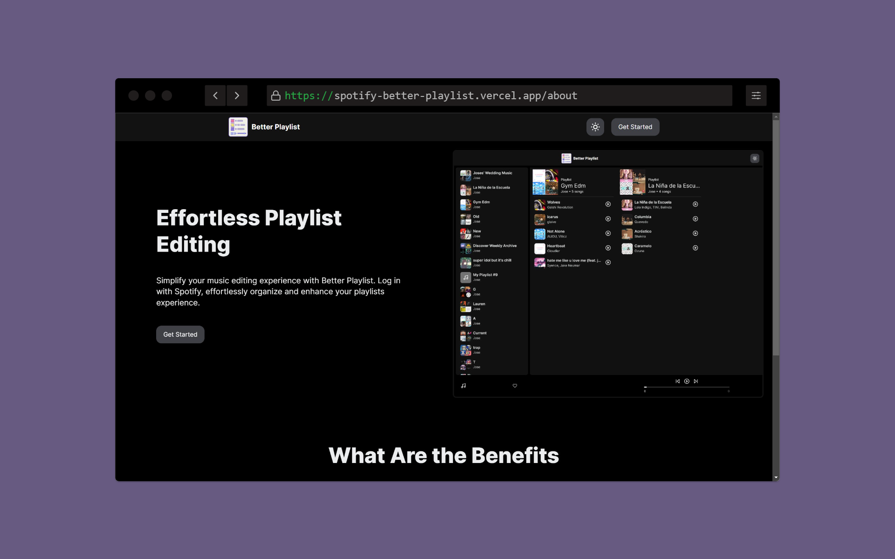

<h2 align="center">
  Spotify Better Playlist<br/>
</h2>
<div align="center">
  
</div>

## TL;DR

There is a hosted version of the website already at [Better Playlist](https://spotify-better-playlist.vercel.app/about) if you would like to test it out.

This is a drag and drop Spotify playlist editor. It lets you open playlists side by side and smoothly move songs back and forth.

If you would like to make any edits you can fork and modify this repo. Please give credit back to
[jfgbecerra](https://github.com/jfgbecerra/spotify-better-playlist).

## Built With

This is a [Next.js](https://nextjs.org/) project bootstrapped with [`create-next-app`](https://github.com/vercel/next.js/tree/canary/packages/create-next-app).

It uses these technologies

- React.js
- Node.js
- Zustand
- Next Auth
- NextUI
- Next Themes
- Pangea DnD
- Tailwind CSS
- VsCode
- Vercel

## Getting Started

Clone down this repository. You will need `node.js` and `git` installed globally on your machine.

Add a .env.local file in the repo and populate in with inforation

You will need spotify app information and NextAuth secrets
[Spotify](https://developer.spotify.com/documentation/web-api/tutorials/getting-started#create-an-app)
[NextAuth](https://next-auth.js.org/getting-started/example)

```
NEXT_APP_SPOTIFY_CLIENT_ID = ""
NEXT_APP_SPOTIFY_SECRET = ""
NEXTAUTH_SECRET = ""
NEXTAUTH_URL = ""
JWT_SECRET = ""
```

## 🛠 Installation and Setup Instructions

1. Installation: `npm install`

2. In the project directory, you can run: `npm run dev`

Runs the app in the development mode.\
Open [http://localhost:3000](http://localhost:3000) to view it in the browser.
The page will reload if you make edits.

## Usage Instructions

After launching the app. You can log in and view begin editing your playlists.

### Show your support

Give a ⭐ if you like this website!
